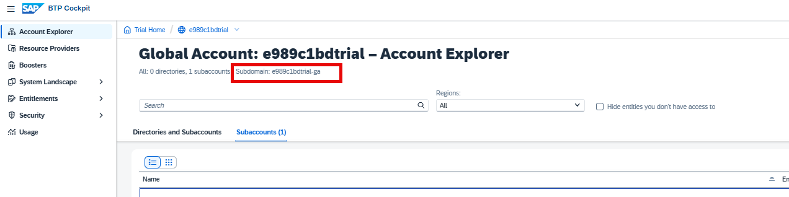

# SAP Build CodeJam Pre-requisites:

## Objective
Automate the steps involved in the pre-requisites for [ SAP Build CodeJam ](https://developers.sap.com/tutorials/codejam-0-prerequisites.html)

## Overview
This repository contains scripts to automate BTP subaccount setup using Terraform. Please follow the instructions below for initial setup and execution.

---

## Pre-requisites

Before starting the deployment process, ensure the following:
- **Node.js (v18 or higher)** and **npm** are installed.
- **CDK for Terraform CLI (`cdktf`)** is installed globally.
- You are an **administrator** of the SAP BTP **Global Account**.
- The Global Account has the **required entitlements** assigned (e.g., relevant service plans used in the Terraform scripts).
- The Global Account has sufficient **resource quotas** (e.g., application runtime, service instances).

Note: By default, these permissions, entitlements, quotas should already be available if this is a fresh BTP Trial account(i.e. Build Apps is not already subscribed in this BTP global account), so no additional setup is necessary.

---

## 1. Prerequisite Software Installation (Local setup)
### Node.js
Download and install Node.js from the official website: 👉 [https://nodejs.org/](https://nodejs.org/)

### Terraform CLI
For information on how to install the Terraform CLI, please refer to the official documentation: [Install Terraform CLI](https://developer.hashicorp.com/terraform/tutorials/aws-get-started/install-cli)

### Terraform CDK
Run the following command:
```sh
npm install --global cdktf-cli@latest
```

---

## 2. Running the Scripts

1. Clone this repository.
2. Rename `.env.example` to `.env` and fill in your BTP email, password, global account subdomain & subaccount name.
3. Run the following command to deploy all required BTP services for the codejam prerequisite:
```sh
npm install
npm run deploy
```
---

## 3. How to Get Your Global Account Subdomain

- Log in to your BTP cockpit.
- Navigate to your BTP global account.
- The global account subdomain is shown in the Global Account explorer.



---

## 4. Environment Parameters

   The `.env` file is used to configure the deployment with your specific BTP account details. Below are the properties you need to set:

   * `btp_admin_email`: Your SAP BTP Global Account administrator email address.

   * `btp_admin_password`: The password for your SAP BTP Global Account administrator.

   * `btp_global_account_subdomain`: Your SAP BTP Global Account subdomain (e.g., `xxx-ga`). Refer to "How to Get Your Global Account Subdomain" section for details.

   * `use_existing_subaccount`: Set to `true` if you want to use an existing subaccount; otherwise, set to `false` to create a new one.

   * `btp_subaccount_domain`: The subdomain for your BTP subaccount. **Required if `use_existing_subaccount` is set to `true`**; otherwise, it is optional and will be generated if creating a new subaccount.

   * `btp_subaccount_name`: The desired name for your BTP subaccount (e.g., `your_subaccount_name_here`). **Required if `use_existing_subaccount` is set to `false`** (i.e., when creating a new subaccount).

   * `btp_subaccount_region`: The region where your subaccount will be created (e.g., `us10`).

   * `cloudfoundry_service_plan`: The service plan for Cloud Foundry (e.g., `trial`).

   * `cloudfoundry_space`: The Cloud Foundry space name (e.g., `dev`).

   * `idp_origin`: The identity provider origin (e.g., `sap.custom`).

For further feedback or questions, please contact the repository maintainers.
